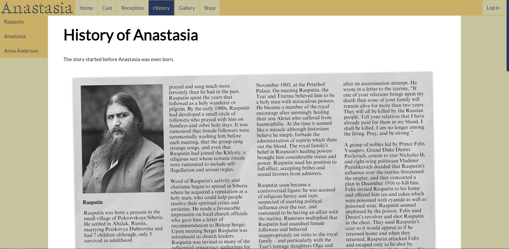

# Anastasia Fan Page

This is a project I did to showcase my favourite movie. It was built using only HTML and CSS with minimal Javascript.

One thing I learned with this project is how much you can do with CSS but also how little you would realistically do with it to get the best results.

In the above image I used CSS to give the appearance of newspaper clippings in a scrapbook to give the large bodies of text a more interesting appearance.

The Fan Page includes the following
  * Plot summary and trailer
  * Cast and characters
  * Box-office reception
  * History behind the tale
  * Gallery of images and soundtracks
